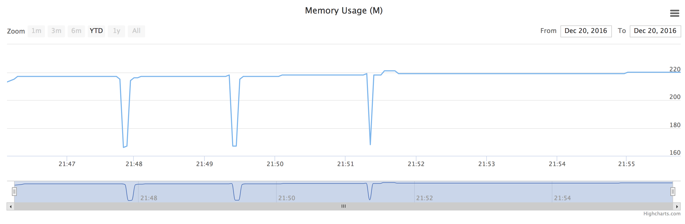

# Sofia
An simple monitor of memory usage in real time


# Installation

```
$ pip install -r requirements.txt
```

# Migrate db

```
$ python manage.py db upgrade
$ python manage.py db migrate
```

# Usage

* run monitor

```
$ python monitor.py
```

* run server

```
$ python manage.py runserver
```

* brower

```
http://127.0.0.1:9009
```

# License

[MIT License](LICENSE)
